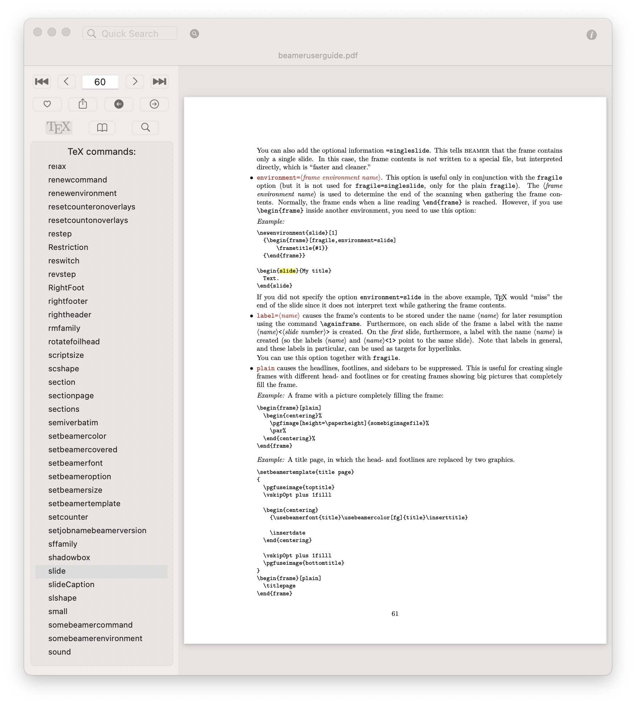
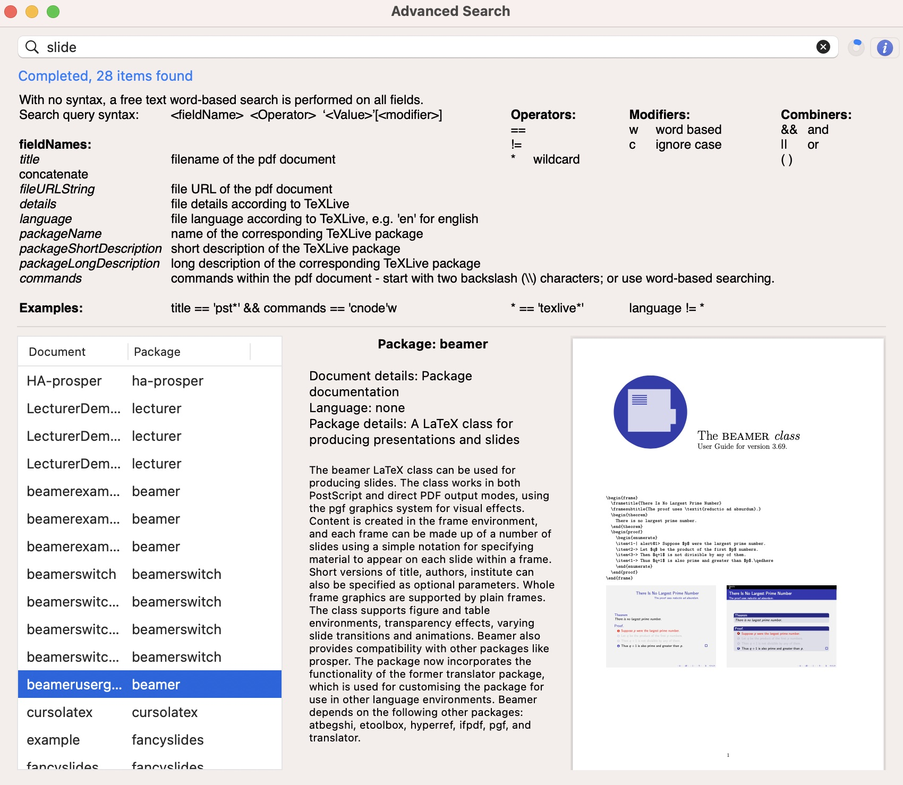

# TeXHelp

# Installing

Download and unzip the .app and drag it to your Applications folder:

<a id="raw-url" href="https://github.com/ndsims/TeXHelp/releases/download/v1.0/TeXHelp.zip">TeXHelp.zip</a>

Alternatively, compile from source using XCode

# About TeXHelp

TeXHelp is a MacOS application that provides a user-friendly interface to the comprehensive help documents packaged with TeXLive:

 

TeXHelp can also index all the pdf files in the TeXLive documentation, to try to identify individual LaTeX commands that are used in each document. This means that searches within TeXHelp can look for individual LaTeX commands, as well as the pdf title and the accompanying TeXLive package information:

 

However, it can take TeXHelp a few hours to index the database when first installed.

# File locations
TEXHelp stores its database in the User’s Library/Containers/com.TeXHelp.TeXHelp folder. This appears as Library/Containers/TeXHelp in Finder. Within an Application Support sub- folder, an sqlite database is generated. For the default settings on TEXLive 2023, this requires about 370MB of storage. Within a Preferences subfolder, three plist files are used to save the configuration. All other files are within the TeXHelp.app.
